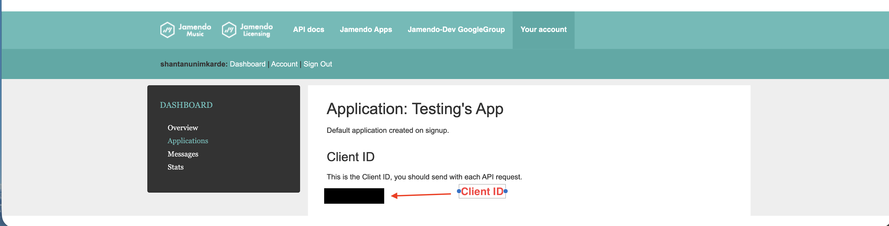

# WorkFM 🎵

A CLI tool to stream royalty-free music from the Jamendo API, perfect for creating the perfect work soundtrack.

## Prerequisites

Before installing WorkFM, ensure you have the following installed on your system:

### ffmpeg
WorkFM uses ffmpeg to process and stream audio files. You must have ffmpeg installed.

**macOS:**
```bash
brew install ffmpeg
```

**Ubuntu/Debian:**
```bash
sudo apt-get install ffmpeg
```

**Windows:**
Download from [ffmpeg.org](https://ffmpeg.org/download.html) or use:
```bash
choco install ffmpeg
```

Verify installation:
```bash
ffmpeg -version
```

## Setup

### Getting a Jamendo API Key

WorkFM uses the [Jamendo API](https://developer.jamendo.com/) to fetch royalty-free tracks. You'll need to create a Jamendo app to get your Client ID.

#### Steps to create a Jamendo App:

1. Visit [Jamendo Developer Portal](https://developer.jamendo.com/)
2. Sign up or log in to your account
3. Navigate to "My Apps" section
4. Click "Create New App"
5. Fill in the app details and accept the terms
6. Your app will be created with a **Client ID** displayed on the app details page

**Important:** Copy the **Client ID** (not the Client Secret)




### Install via npm / use directly via npx

```bash
npm install -g workfm
```

You can also use `npx` if you would like to avoid a permanent installation.

```bash
npx workfm <command>
```

### Configure Your API Key

Run the following command with your Jamendo Client ID:

```bash
workfm config set YOUR_JAMENDO_CLIENT_ID
```

This will save your API key to `~/.workfm/config.json`

## Usage


### Show all available stations

```bash
workfm show stations
```

### Play a station

```bash
workfm play <station>
```

Available stations: `lofi` (default), and others

Example:
```bash
workfm cafe
```

### Play with default station

```bash
workfm
```

This plays the default "lofi" station.

### Search for music

```bash
workfm -s "jazz music"
```

Use the `-s` or `--search` flag to search for specific types of music.

### Examples

```bash
# Play lofi hip-hop (default)
workfm

# Play a specific station
workfm cafe

# Search for jazz
workfm -s "jazz"

# Search for upbeat music
workfm -s "upbeat electronic"
```

## Configuration

Your Jamendo Client ID is stored in `~/.workfm/config.json`. If you need to update it, simply run:

```bash
workfm config set NEW_CLIENT_ID
```

## Development

### Run in development mode:
```bash
npm run dev -- play cafe
```

### Build for production:
```bash
npm run build
```

### Debug mode:
```bash
npm run debug -- play rain
```

## About Jamendo

WorkFM uses the [Jamendo API](https://www.jamendo.com/) to fetch royalty-free music. Jamendo is a platform hosting thousands of independent artists' work with permissive licensing.

## License

ISC
